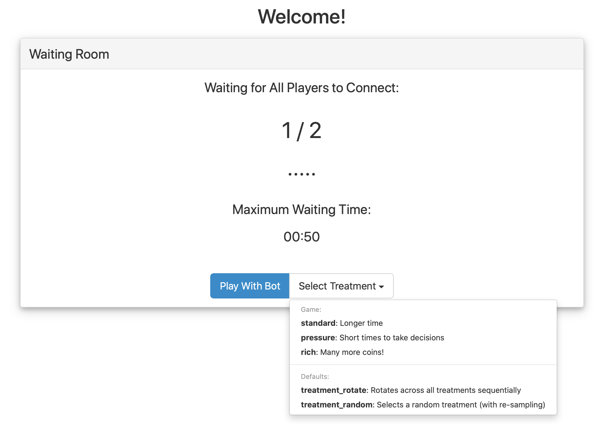
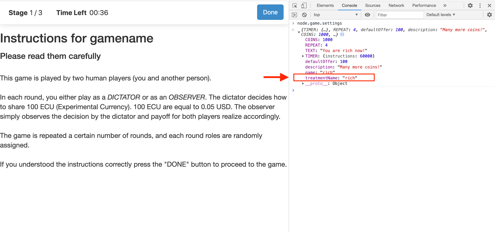

- status: complete
- version: 5.x
- follows from: [Settings and Treatments](Settings-and-Treatments-v5)

In the following sections, several JavaScript examples will be provided. To try out these examples, you will need a text editor to edit the files on your computer. We recommend the [Atom](https://atom.io/) editor and this guide shows you how to [configure it](https://nodegame.org/data/courses/oe/pdf/Appendix_oe_configure_atom.pdf) properly.

For every example, open the file specified in the instructions with your text editor, and edit it according to the example. Once finishing editing, remember to save the file and restart the server with the command: `node launcher.js`. Then, access nodeGame and check the changes.

### Modifying the treatments

Continuing with the last example of [treatment](Settings-and-Treatments-v5) settings, you can create a new `treatment` called "rich" simply adding a new object inside the `treatments` object. See the example below:

```javascript
treatments: {
    standard: {
        description: "Longer time",
        bidTime: 30000
    },

    pressure: {
        description: "Short times to take decisions",
        bidTime: 10000
    },

    // New treatment addeed:
    rich:{
        description: "Many more coins!",
        COINS: 1000,
        // Defines a new variable named TEXT.
        TEXT: "You are rich now!"
  },

}

```

### Testing your changes

To test your changes you need to restart the server.

If your server is already running, you must stop it by holding down the keys Ctrl and C in the _same_ Git Bash console where you previously launched it.

Then simply launch the server with command (from the nodeGame root directory):

```js
node launcher.js
```

 Then open the browser and you should be able to see the changes as below:




### More on Settings and Treatments

All the game variables of the selected treatment are automatically sent to every connected client and stored as `node.game.settings`. For example, if you select a "rich" treatment, type `node.game.settings` in the browser console, and you will be able to see the settings object.



Moreover, all treatment's settings are also available during the definition of client types (see Section [Client Types](Client-Types-v5)).


# Next Topics

* Next: [How to create the game sequence](Game-Sequence-v5)
