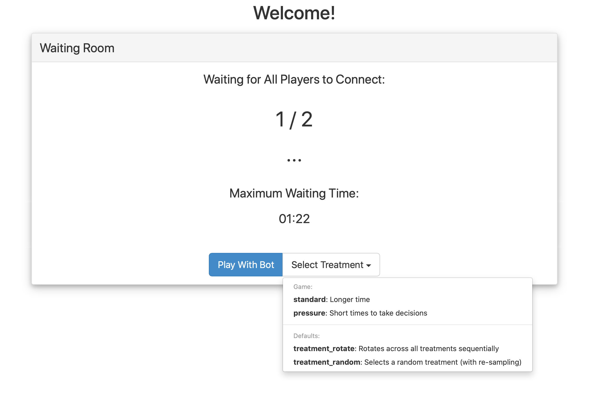

- status: complete
- version: 5.x
- follows from: [Game Basics](Game-Basics-v5)


All game variables and treatments are contained in the file
`game/game.settings`. It is appropriate to store in this files variables such as: the number of coins available in the game, the duration of timers, or the exchange rate between experimental coins and some real world currency.

```javascript
{

  COINS: 100,

  EXCHANGE_RATE: 0.0001,

  TIMER: {
      instructions: 60000,
      bidder: 30000,
  },

  WAIT_TIME: 30,

  WAIT_TIME_TEXT: 'Somebody disconnected!',

}
```

### Creating a treatment

Game variables can be grouped together under a common label to create
a _treatment_. Simply add a variable named `treatments` inside this file to start defining treatments.

Each treatment is an object nested inside the `treatments` object.

```javascript
{
  // Other game variables omitted.

  // The treatments object is a special default variable
  // which contains treatments objects.
  treatments: {

      // Name of the treatment.
      rich_treatment: {

          // One-sentence description (mandatory).
          description: 'Many more coins!',

          // Overwrites the default variable COINS,
          // but still inherits EXCHANGE_RATE.
          COINS: 1000,

          // Defines a new variable named TEXT.
          TEXT: "You are rich now!"

          // Other treatment variables here.
      }

      // Other treatments here.
  }
}
```

#### The settings object

Each treatment inherits all the variable defined outside the `treatments` object, while variables defined inside the `treatments` object are available only to a specific treatment. So the final settings object for the  "rich_treatment" treatment will be:

```js

// Name of the treatment.
{

    EXCHANGE_RATE: 0.0001,

    TIMER: {
        instructions: 60000,
        bidder: 30000,
    },

    WAIT_TIME: 30,

    WAIT_TIME_TEXT: 'Somebody disconnected!',

    // One-sentence description (mandatory).
    description: 'Many more coins!',

    // Overwrites the default variable COINS,
    // but still inherits EXCHANGE_RATE.
    COINS: 1000,

    // Defines a new variable named TEXT.
    TEXT: "You are rich now!",

    treatmentName: "rich_treatment"

}
```

**Note!** In the final settings object:

- the treatment name is stored under a variable named `treatmentName`,
- the value of game variables defined both inside and outside the treatment object (here: `COINS`) is always equal the value inside the treatments object.


#### The standard treatment

If no treatment is defined, all game variables are grouped together under a treatment named `standard`.

### Reserved game variables

Game developers can define as many game variables as needed, however
some names are reserved for special purposes. For example,

 * **TIMER**: an object containing the values (in milliseconds) of the
   timers of each step. If a step with the same of one of the
   properties of the TIMER object is found, then a new timer is
   instantiated with the duration (or options) containing in the TIMER
   object.     
 * **WAIT\_TIME**: the waiting time (in seconds) for a disconnected player
   to reconnect.
 * **WAIT\_TIME\_TEXT**: the text display to other players while waiting
   for a player to reconnect.

### Assigning a treatment to a game room

When a new game starts, the [waiting room](Waiting-Room-v5) selects
and assigns a treatment among those available. This can be either done automatically, or users can be choose a treatment themselves as shown below.



#### Where to find the settings object

After a treatment has been decided, the final settings object is stored under `node.game.settings`. More on this later.

In the later sections, you will learn how to modify and test the settings with provided examples.


## Next Topics

* Next: [Learn how to run the examples](Run-and-Test-the-Examples-v5)
